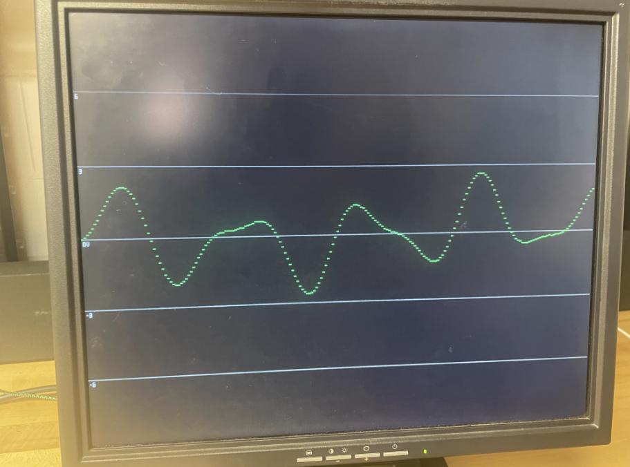
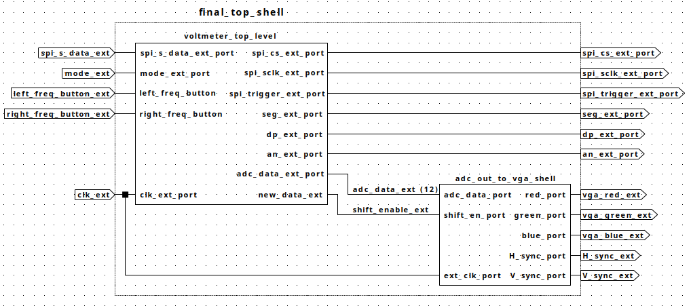
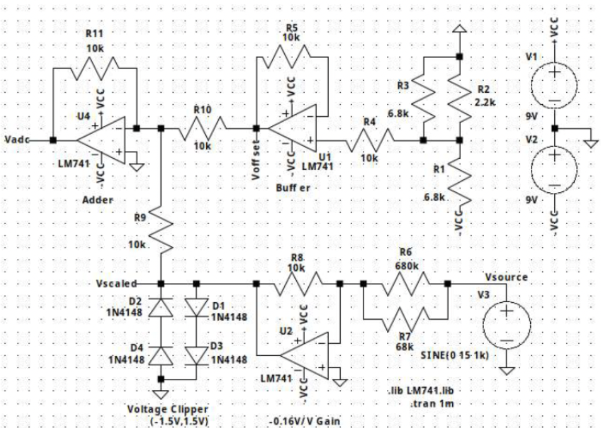

# FPGA Digital Oscilloscope

A real-time digital oscilloscope implemented in VHDL on a Digilent Basys 3 (Artix-7) FPGA, displaying live analog waveforms on a VGA monitor. The system samples a ±9 V analog input through a custom op-amp front-end and a 12-bit SPI ADC, buffers the sample history on-chip, and renders the waveform at 640×480 via VGA — with push-button control of the sampling rate and a seven-segment voltmeter readout.

## Features

- **Live waveform display** — 640-sample rolling history rendered on a VGA monitor (640×480 @ 60 Hz)
- **±9 V input range** — custom analog front-end (op-amp attenuator + level shifter + diode clippers) maps ±9 V to the ADC's 0.2–3.3 V range
- **12-bit acquisition** — SPI communication with a PMOD ADC
- **Adjustable timebase** — push-buttons increase/decrease the sampling frequency setting (debounced, mono-pulsed, with min/max saturation)
- **Voltmeter mode** — live numeric voltage readout on the seven-segment display
- **Tear-free rendering** — framebuffer updates only at frame boundaries to prevent visual artifacts

## System Architecture

The design is fully modular, split into two clock-synchronized paths:

1. **Acquisition path** — an SPI receiver collects serial ADC bits into 12-bit samples; a chip-select rising-edge detector (with 2-stage synchronizer for clock-domain safety) emits a one-clock `new_data` pulse per completed conversion.
2. **Display path** — each new sample shifts into a 640 × 12-bit history buffer; a combinational preparation block downsizes samples to 9-bit y-coordinates (inverted and clamped to the 480-line visible region); the framebuffer compares stored coordinates against the current pixel position from the VGA sync generator to drive the RGB outputs.

### Module Hierarchy

| Module | Description |
|---|---|
| `final_top_shell` | Top level — integrates acquisition and display subsystems |
| `voltmeter_top_level` | ADC communication wrapper; produces 12-bit samples + 7-seg display |
| `spi_receiver` | Deserializes ADC data over SPI |
| `cs_rising_edge` | Synchronizes chip-select, generates one-clock new-sample pulse |
| `freq_ratio_controller` | Push-button sampling-frequency control (debounce + edge detect + saturation) |
| `mux7seg` | Seven-segment display driver |
| `adc_out_to_vga_shell` | Display-path wrapper |
| `adc_data_shiftreg` | 640 × 12-bit rolling sample history |
| `vga_prep` | Combinational ADC-value → y-coordinate conversion (downsize, invert, clamp) |
| `vga_sync` | VGA 640×480 timing: sync pulses, pixel coordinates, video-on, frame boundary |
| `framebuffer` | Waveform + static GUI rendering; frame-synchronized buffer updates |

## Analog Front-End

The ADC accepts 0–3.3 V, so the input is conditioned with an op-amp circuit implementing `V_adc = G·V_in + V_offset` (G = 0.169 V/V, V_offset = 1.78 V), mapping −9…+9 V onto 0.26–3.30 V. Diode clippers protect the ADC from over-voltage.

## Verification

Every major block was verified with a behavioral testbench (in [`tb/`](tb/)) before integration:

- **SPI receiver / voltmeter path** — validated in simulation and on hardware (logic-analyzer capture of `spi_cs`, `spi_sclk`, `spi_data`, `new_data`)
- **Frequency controller** — verified debouncing, exactly-one-pulse-per-press, and min/max saturation
- **Edge detector** — one pulse per conversion, no retriggering while chip-select stays high
- **Shift register** — sample ordering, history preservation, and correct blocking when `shift_en` is low
- **VGA prep** — self-checking testbench with assertions on the exact ADC-to-coordinate mapping (0→480, 2048→255, 4095→0), covering downsizing, axis inversion, and clamping
- **VGA sync** — timing checked against the 640×480 VGA specification
- **Framebuffer** — pixel match logic and frame-boundary-only updates (no tearing)

Full system validated on hardware with a function generator driving the analog front-end. Simulation waveforms are in [`docs/waveforms/`](docs/waveforms/); full details in the [project report](docs/report.pdf).

## Resource Utilization

| Resource | Used |
|---|---|
| Slice LUTs | 5,039 |
| Slice Registers | 11,706 |
| Block RAM Tiles | 2 |
| Bonded IOB | 34 |

Synthesized and implemented with zero warnings.

## Build

1. Open Vivado and create a project targeting the Digilent Basys 3 (Artix-7 XC7A35T)
2. Add all sources from `rtl/` and the constraints file from `constraints/`; set the VHDL file type to **VHDL 2008** (the design uses 2008 features such as `process(all)` and conditional signal assignment in processes)
3. Generate the `blk_mem_gen_0` IP (Block Memory Generator: single-port ROM, 16-bit width, 4096 depth) initialized with `rtl/acquisition/myVoltmeter.coe` — this ROM converts raw ADC codes to display voltages for the seven-segment readout
4. Connect the PMOD ADC and analog front-end per the schematic above
5. Synthesize, implement, and program the board; connect a VGA monitor
## Future Work

- **Trigger mode** — stabilize the display on repetitive signals (classic oscilloscope triggering)
- FFT / spectrum display mode
- Adjustable vertical (voltage) scaling, cursors, persistence

## Credits

Developed as the final project for ENGS 31 (Digital Electronics) at Dartmouth's Thayer School of Engineering, Spring 2026, in a team of three with [Soleil Demick](https://github.com/dirichlettt) and Helin Wang.

My primary contributions: the frequency-ratio controller (debouncing, mono-pulse generation, saturation logic), technical documentation, and system-level integration, hardware debugging, and validation across both subsystems.

The ADC acquisition subsystem builds on the course's Lab 6 voltmeter design. Thanks to Professor Luke, Tad Truex, and the ENGS 31 course staff.
